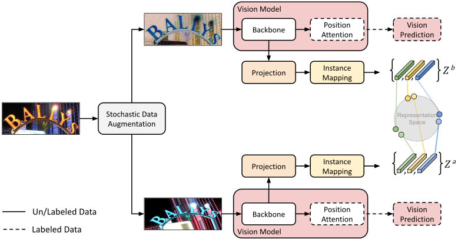
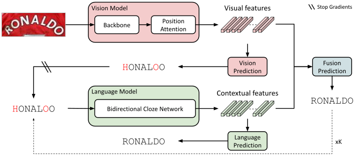

# Multimodal Semi-Supervised Learning for Text Recognition

The official code implementation of [SemiMTR](https://arxiv.org/pdf/2205.03873)
| [Pretrained Models](#Pretrained-Models) | [Demo](#demo).

**[Aviad Aberdam](https://sites.google.com/view/aviad-aberdam/home),
[Roy Ganz](https://il.linkedin.com/in/roy-ganz-270592),
[Shai Mazor](https://il.linkedin.com/in/shai-mazor-529771b),
[Ron Litman](https://scholar.google.com/citations?hl=iw&user=69GY5dEAAAAJ)**

We introduce a multimodal semi-supervised learning algorithm for text recognition, which is customized for modern
vision-language multimodal architectures. To this end, we present a unified one-stage pretraining method for the vision
model, which suits scene text recognition. In addition, we offer a sequential, character-level, consistency
regularization in which each modality teaches itself. Extensive experiments demonstrate state-of-the-art performance on
multiple scene text recognition benchmarks.

### Figures

- SemiMTR vision model pretraining: Contrastive learning
  
  <br/><br/><br/><br/>

- SemiMTR model fine-tuning: Consistency regularization
  
  <br/><br/><br/><br/>

- SemiMTR model architecture: ABINet Model
  

# Getting Started

<h3 id="demo"> 
    Run Demo with Pretrained Model 
    <a 
    href="https://colab.research.google.com/github/amazon-research/semimtr-text-recognition/blob/master/notebook_demo.ipynb" target="_parent">
    
    </a> 
</h3>

## Dependencies

- Inference and demo requires PyTorch >= 1.7.1
- For training and evaluation, install the dependencies

```
pip install -r requirements.txt
```

## Pretrained Models

Download pretrained models:

- [SemiMTR Real-L + Real-U](https://awscv-public-data.s3.us-west-2.amazonaws.com/semimtr/semimtr_real_l_and_u.pth)
- [SemiMTR Real-L + Real-U + Synth](https://awscv-public-data.s3.us-west-2.amazonaws.com/semimtr/semimtr_real_l_and_u_and_synth.pth)
- [SemiMTR Real-L + Real-U + TextOCR](https://awscv-public-data.s3.us-west-2.amazonaws.com/semimtr/semimtr_real_l_and_u_and_textocr.pth)

Pretrained vision models:

- [SemiMTR Vision Model Real-L + Real-U](https://awscv-public-data.s3.us-west-2.amazonaws.com/semimtr/semimtr_vision_model_real_l_and_u.pth)

Pretrained language model:

- [ABINet Language Model](https://awscv-public-data.s3.us-west-2.amazonaws.com/semimtr/abinet_language_model.pth)

## Datasets

- Download preprocessed lmdb dataset for training and
  evaluation.  [Link](https://github.com/ku21fan/STR-Fewer-Labels/blob/main/data.md#download-preprocessed-lmdb-dataset-for-traininig-and-evaluation)
- For training the language model, download WikiText103. [Link](https://github.com/FangShancheng/ABINet#datasets)
- The structure of `data` directory is
    ```
    data
    ├── charset_36.txt
    ├── training
    │   ├── label
    │   │   ├── real
    │   │   │   ├── 1.SVT
    │   │   │   ├── 2.IIIT
    │   │   │   ├── 3.IC13
    │   │   │   ├── 4.IC15
    │   │   │   ├── 5.COCO
    │   │   │   ├── 6.RCTW17
    │   │   │   ├── 7.Uber
    │   │   │   ├── 8.ArT
    │   │   │   ├── 9.LSVT
    │   │   │   ├── 10.MLT19
    │   │   │   └── 11.ReCTS
    │   │   └── synth (for synthetic data, follow guideline at https://github.com/ku21fan/STR-Fewer-Labels/blob/main/data.md)
    │   │       ├── MJ
    │   │       │   ├── MJ_train
    │   │       │   ├── MJ_valid
    │   │       │   └── MJ_test
    │   │       ├── ST
    │   │       ├── ST_spe
    │   │       └── SA
    │   └── unlabel
    │       ├── U1.Book32
    │       ├── U2.TextVQA
    │       └── U3.STVQA
    ├── validation
    │   ├── 1.SVT
    │   ├── 2.IIIT
    │   ├── 3.IC13
    │   ├── 4.IC15
    │   ├── 5.COCO
    │   ├── 6.RCTW17
    │   ├── 7.Uber
    │   ├── 8.ArT
    │   ├── 9.LSVT
    │   ├── 10.MLT19
    │   └── 11.ReCTS
    ├── evaluation
    │   ├── benchmark
    │   │   ├── SVT
    │   │   ├── IIIT5k_3000
    │   │   ├── IC13_1015
    │   │   ├── IC15_2077
    │   │   ├── SVTP
    │   │   └── CUTE80
    │   └── addition
    │       ├── 5.COCO
    │       ├── 6.RCTW17
    │       ├── 7.Uber
    │       ├── 8.ArT
    │       ├── 9.LSVT
    │       ├── 10.MLT19
    │       └── 11.ReCTS 
    ├── WikiText-103.csv (for training LM)
    └── WikiText-103_eval_d1.csv (for training LM)
    ```

## Training

1. Pretrain vision model
    ```
    CUDA_VISIBLE_DEVICES=0,1,2,3 python main.py --config configs/semimtr_pretrain_vision_model.yaml
    ```
2. Pretrain language model
    ```
    CUDA_VISIBLE_DEVICES=0,1,2,3 python main.py --config configs/pretrain_language_model.yaml
    ```
3. Train ABINet
    ```
    CUDA_VISIBLE_DEVICES=0,1,2,3 python main.py --config configs/semimtr_finetune.yaml
    ```

Note:

- You can set the `checkpoint` path for vision and language models separately for specific pretrained model, or set
  to `None` to train from scratch

### Training ABINet

1. Pre-train vision model
    ```
    CUDA_VISIBLE_DEVICES=0,1,2,3 python main.py --config configs/abinet_pretrain_vision_model.yaml
    ```
2. Pre-train language model
    ```
    CUDA_VISIBLE_DEVICES=0,1,2,3 python main.py --config=configs/pretrain_language_model.yaml
    ```
3. Train ABINet
    ```
    CUDA_VISIBLE_DEVICES=0,1,2,3 python main.py --config=configs/abinet_finetune.yaml
    ```

## Evaluation

```
CUDA_VISIBLE_DEVICES=0 python main.py --config configs/semimtr_finetune.yaml --run_only_test
```

## Arguments:

- `--checkpoint /path/to/checkpoint` set the path of evaluation model
- `--test_root /path/to/dataset` set the path of evaluation dataset
- `--model_eval [alignment|vision]` which sub-model to evaluate

## Acknowledgements

This implementation has been based on the repository [ABINet](https://github.com/FangShancheng/ABINet).

## Contact

Feel free to contact us if there is any question: [Aviad Aberdam](mailto:aaberdam@amazon.com?subject=[GitHub-SemiMTR])

## Citation

If you find our method useful for your research, please cite

```
@article{aberdam2022multimodal,
  title={Multimodal Semi-Supervised Learning for Text Recognition},
  author={Aberdam, Aviad and Ganz, Roy and Mazor, Shai and Litman, Ron},
  journal={arXiv preprint arXiv:2205.03873},
  year={2022}
}

@inproceedings{aberdam2021sequence,
  title={Sequence-to-sequence contrastive learning for text recognition},
  author={Aberdam, Aviad and Litman, Ron and Tsiper, Shahar and Anschel, Oron and Slossberg, Ron and Mazor, Shai and Manmatha, R and Perona, Pietro},
  booktitle={Proceedings of the IEEE/CVF Conference on Computer Vision and Pattern Recognition},
  pages={15302--15312},
  year={2021}
}
 ```

## Security

See [CONTRIBUTING](CONTRIBUTING.md#security-issue-notifications) for more information.

## License

This project is licensed under the Apache-2.0 License.
